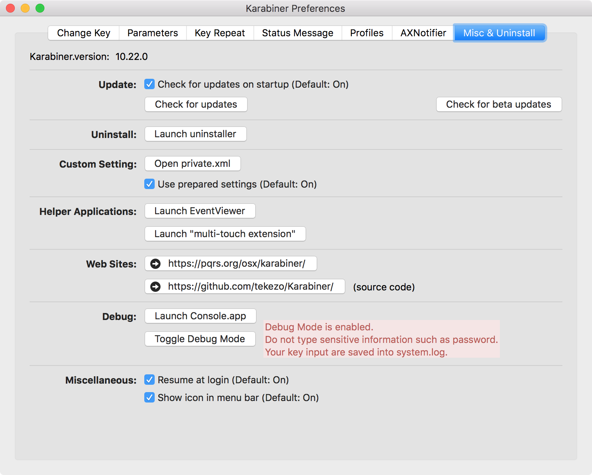

# Description
**Keyboard Event Visualizer** observes all Keyboard events from
`/private/var/log/system.log` and Visualize useful statistics in real time.

# Requirements

## Karabiner
Install [Karabiner](https://pqrs.org/osx/karabiner/), go to settings and under
the `Misc & Uninstall` tab enable the `Debug Mode` option.

